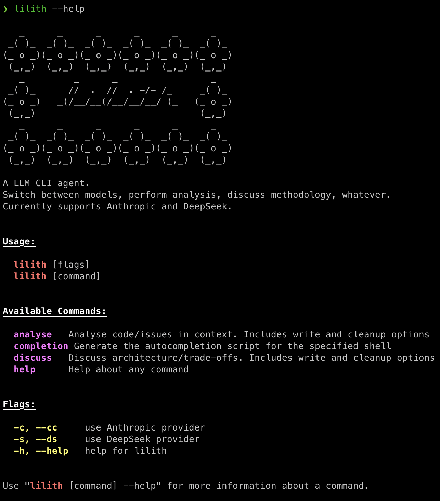

# Lilith CLI

A terminal-first **LLM agent** for technical analysis, architecture discussions, and general exploration.  
Supports **Anthropic Claude** and **DeepSeek** out of the box.




```
lilith --help

lilith analyse --cc "how to refactor into repository pattern?"
lilith analyse --write
lilith analyse --cleanup

lilith discuss "should we switch from Jest to Vitest?"
lilith discuss --write
lilith discuss --cleanup
```


## Features
- Switch between providers (`--cc` for Claude, `--ds` for DeepSeek`).
- **Chat** mode for quick Q&A.
- **Analyse** mode for feature/code deep diver (`--write`, `--cleanup`).
- **Discuss** mode for architecture & trade-offs.
- Persisted sessions in `~/.lilith/` per mode.
- Markdown output rendered with [glamour](https://github.com/charmbracelet/glamour).

---

## Setup
`.env` file in project root:
```dotenv
DEEPSEEK_API_KEY=
DEEPSEEK_MODEL=

ANTHROPIC_API_KEY=
ANTHROPIC_MODEL=
```

Then build
```
go build -o lilith ./cmd/lilith
```
And move to bin
```
mv lilith ~/bin/
```